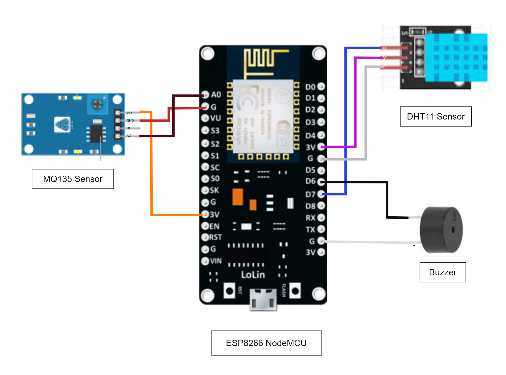

# Air Monitor System Documentation

## Hardware Architecture

### Hardware Components

- **ESP NodeMCU**
- **DHT11 Sensor**
- **MQ135 Sensor**
- **Buzzer**
- **8 Female Jumper Wires**

    - DHT11 Sensor
    
      - VCC to 3.3V
      - GND to GND
      - Data to D7
    
    - MQ135 Sensor
    
      - VCC to 3.3V
      - GND to GND
      - AOUT to A0
      
    - Buzzer
    
      - Positive to D6
      - Negative to GND

## Software Architecture

### Software Tools and Services

- **GitHub**: Repository for Code Management
- **ThingSpeak Cloud**: Real-time Sensor Data Upload
- **Arduino IDE**: Embedded C Programming
- **HTML**, **CSS** (Bootstrap), **JavaScript**: Website Development
- **Netlify**: Hosting the Website
  
## Website Integration

- Integrated ThingSpeak iframe for live sensor data dashboard.

## Detailed Documentation

Provide detailed explanations, step-by-step guides, and code snippets for each component and functionality:

1. **Setup and Wiring**: Detailed instructions on connecting NodeMCU, sensors, and peripherals.
   
2. **Offline Code**: Explain the code for monitoring air quality without internet connectivity.
   
3. **Online Code**: Detail the code to upload real-time data to ThingSpeak cloud.
   
4. **Website Development**: Steps to create and host a website displaying live data using HTML, CSS, and JavaScript.
   
5. **Troubleshooting**: Common issues and solutions encountered during the project.

## Conclusion

Summarize the project's objectives, outcomes, and future enhancements.
